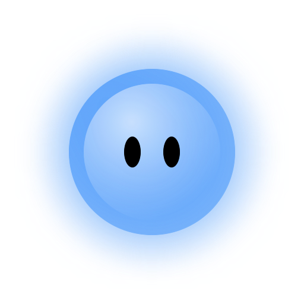
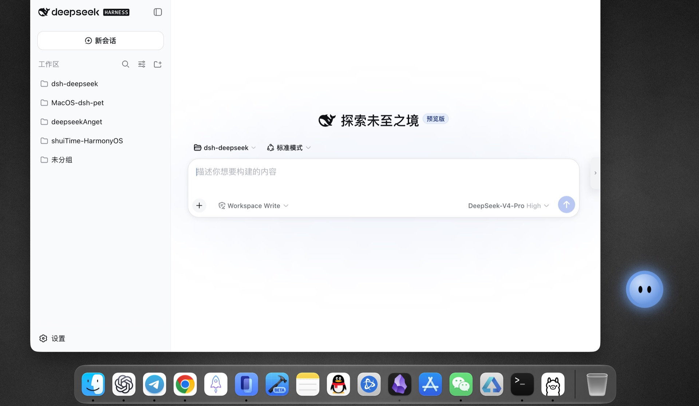

<p align="center">
  
</p>

<h1 align="center">MoodBall（心情球）</h1>

<p align="center">
  DeepSeek Harness macOS Desktop Pet —— 让 Agent 状态飞出 Web UI，悬浮在你桌面的任意位置<br>
  菜单栏常驻 + 置顶桌宠，支持心情球与小雨两种皮肤，随 Agent 状态实时变化
</p>

<p align="center">
  macOS 14+ · SwiftUI 原生应用 · 需要 DeepSeek Harness（DSH）运行
</p>

<p align="center">
  <a href="https://github.com/sundusk/dsh-moodball/releases/latest">⬇️ 下载最新 Release</a>
</p>

## 🎈 这是什么？

**心情球**把 Agent 的状态带到你的**整个桌面**上。它是一颗真正「活在桌面上」的悬浮球：
按住即可拖到屏幕**任意位置**（位置会被记住），完全不局限于 DeepSeek Harness 的 Web UI 页面内——
即使浏览器已最小化、甚至从头到尾都不打开 Web UI，也能随时看到任务状态。
小球颜色随 Agent 运行状态实时呼吸变化（正在思考中/工具调用/等待你的授权/做出你的抉择/搞定啦/出错了…），
非空闲时头顶还会弹出**漫画风说话气泡**，空闲时自动隐藏。瞄一眼桌面，就知道任务进度。

### 项目组成

- **MoodBall.app**：桌面宠物本体（心情球 / 小雨）
- **dsh-moodball-status**：状态与输入桥接插件（订阅 Agent 会话事件，提供 HTTP/状态 Socket 兼容接口，以及用户级命令 Socket；无 Harness Web UI、无设置项）

一切配置都在 app 的设置面板里完成。

### 📸 效果展示

<p align="center">
  
</p>

<p align="center">
  悬浮在桌面上的心情球 —— 可拖到屏幕任意位置，随时查看 Agent 状态
</p>

## 🚀 安装

### 安装依赖

1. **macOS 14+**
2. **DeepSeek Harness**：支持桌面版、NPM/NPX 版和官方源码版，安装方法见 [官方文档](https://github.com/deepseek-ai/deepseek-harness)
3. **CLI 版依赖**：NPM/NPX 版需要 Node.js；源码版需要在源码根目录可运行 `pnpm dsh`

### 方式一：一键安装（推荐）

```bash
curl -fsSL https://github.com/sundusk/dsh-moodball/raw/refs/heads/main/install.sh | bash
```

脚本会自动：

1. 检测当前正在运行的 Harness，并识别桌面版、NPM/NPX 版或源码版
2. 源码版在实际源码根目录执行 `pnpm dsh`；NPM/NPX 版执行对应的 `dsh` 或 `npx` CLI
3. CLI 版在目标 Harness 的 `web` profile 中检测/安装状态插件；桌面版通过应用内「插件」页面安装
4. 从 GitHub latest release 下载 `MoodBall.app`（本地存在 `dist/MoodBall.app` 时优先使用）
5. 优先安装到 `/Applications`，无权限时自动回退到 `~/Applications` 并启动；安装后只保留这一个 MoodBall.app，另一安装目录和本地 `dist` 副本会移入废纸篓

脚本只需要执行一次。若插件刚安装而当前 Harness 正在运行，脚本仍会继续安装并启动
MoodBall.app；请在当前任务完成后重启一次 DeepSeek Harness 让插件加载，**无需再次运行安装脚本**。
如果 Harness 当前没有运行，MoodBall 会先显示“未连接”，启动 Harness 后自动连接。

安装器不会自动停止或重启正在运行的 Harness，也不会把状态接口暂时不可达直接判断为“插件未安装”。
如果同时存在多个源码版 Harness 且当前都未运行，会要求选择目标；不会静默把插件装进错误的仓库。

源码版也可以显式指定：

```bash
DSH_SOURCE_ROOT="$HOME/Projects/deepseek-harness" bash install.sh
```

安装器会复用当前环境或已识别 Harness 的 `DSH_HOME`，并将最近使用的 Harness 类型、源码路径和 profile
记录在 `~/Library/Application Support/MoodBall/config.json`，供下一次安装使用。

桌面版使用独立的 `desktop` profile。请在桌面版「插件」页面安装并启用 `github:sundusk/dsh-moodball`，再重启桌面版让插件加载。公开 `dsh plugin` CLI 不能管理桌面版 profile；安装器检测到桌面版时不会把插件误装到 `web` profile。MoodBall 使用本地 Socket 接收桌面版状态；桌面版晚启动或重启后会自动重连。

### 方式二：仓库安装

```bash
git clone --depth 1 https://github.com/sundusk/dsh-moodball.git
cd dsh-moodball
bash install.sh
```

与方式一完全等价（方式一其实就是直接运行仓库里的 install.sh），适合想顺带查看源码/自行构建的用户。

### 方式三：下载 Release

从 [最新 Release](https://github.com/sundusk/dsh-moodball/releases/latest)
下载 `MoodBall.app.zip`，解压后放入 `~/Applications`（或「应用程序」），双击「MoodBall」启动。

> 提示：Release 安装不会自动装插件。若尚未安装，请先在终端执行
> 对 NPM/NPX 版执行 `dsh plugin --profile web add github:sundusk/dsh-moodball`；
> 对源码版必须在源码根目录执行 `pnpm dsh plugin --profile web add github:sundusk/dsh-moodball`，然后重启对应 Harness。

## ✨ 使用

安装并启动后，**桌面上没有任何窗口**——它是个纯菜单栏应用（不占 Dock、不抢焦点）：
菜单栏右侧出现状态图标，桌面右下角出现当前皮肤的悬浮桌宠。

### 以后怎么打开？

- **访达 → 应用程序（或 ~/Applications）**：找到「MoodBall」，双击
- **终端**：`open -a MoodBall`

### 菜单栏图标功能

| 菜单项 | 功能 |
|---|---|
| 状态文字 | 当前连接状态、状态名与桥接方式（如「已连接 · 工具调用 · 本地桥接」） |
| 隐藏 / 显示全部 | 同时隐藏或显示桌宠与快捷控件 |
| 隐藏 / 显示桌宠形象 | 切换“宠物＋控件”和“仅控件（Mini）”，不影响另一套位置 |
| 设置… | 打开设置面板 |
| 退出 | 退出 app（不影响 DSH 本体） |

### 小球交互

- **拖动**：按住小球任意位置拖动，可把它移到任何地方（位置会记住）
- **双击**：小球左右摇动约 2 秒，表示兴奋
- **锁定位置**（设置面板 → 行为）开启后不可拖拽，仍可双击

### 第一阶段：快捷入口与 Mini 模式

- 默认按 **Option+Space**，可在「设置 → 快捷键」重新录入组合键或关闭。快捷键冲突时 MoodBall 不会抢占其他应用，并会在设置面板提示。
- 「设置 → 快捷键」的“功能快捷键”区域可分别修改或关闭输入消息、新建会话、选择工作区、打开 Harness、显示/隐藏浮层、打开设置和状态展示的菜单快捷键；默认使用不冲突的 `⌘` 组合键。
- 快捷键会显示并聚焦输入框；输入框已打开时重复按下不会关闭、不清空草稿。按 Esc 收起输入框，中文输入法选字时 Enter 仍只确认候选文字。
- 「设置 → 外观 → 显示模式」可选择“宠物＋控件”或“仅控件（Mini）”。Mini 模式隐藏宠物形象，只保留输入控件；拖动控件左侧的把手可独立移动，位置与桌宠分别保存。
- “隐藏全部”只控制当前全部浮层；切换到 Mini 模式只隐藏宠物形象，快捷控件仍可用。点击穿透设为“永远点击穿透”时，鼠标不能拖动控件，但全局快捷键仍可唤起输入框。

### 向 Harness 发送消息

宠物下方的短横条会在鼠标靠近时变成笔记按钮。点击后展开原生输入框：

- 首次发送前选择 Harness 已注册的工作区，MoodBall 会记住目标。
- Enter 发送，Shift+Enter 换行；中文输入法选字时 Enter 只确认候选文字。
- 第一条消息创建 MoodBall 专用会话，后续消息沿用同一会话；执行中、等待授权或等待回答时暂时不能继续发送。
- “新建会话”只解除当前绑定，不会删除或停止旧 Harness 任务；“打开 Harness”进入现有 Harness 首页。
- 命令插件不可用时仍可显示旧版状态，但输入功能会明确禁用；草稿不会被静默丢弃。

### 第二阶段：多任务卡片与提醒

- 待机时保留宠物下方的短横线；鼠标指向宠物后显示紧凑操作栏，仅包含输入按钮、任务提醒和必要的展开箭头，不放语音按钮或空白占位。
- 当前工作区的普通 Harness 会话会显示为任务卡片，子 Agent 不单列。多任务默认只显示排序第一项，箭头展开纵向列表，最多直接显示四张，超出部分在卡片区域内滚动。
- 排序优先级为等待操作、失败未读、完成未读、运行中、其他最近更新任务。点击卡片查看详情并标记已读；“继续此会话”才会切换输入目标，当前草稿不为空时会先阻止切换。
- 任务标题、状态图标和更新时间优先来自 Harness；标题服务不可用时使用工作目录和会话 ID 后缀回退。未读位置由 MoodBall 本地保存，首次加载不会把历史任务批量标成未读，重连后会继续使用已读位置。
- 精确打开会话仍未发现可由插件调用的官方外部深链，因此详情提供“打开 Harness”和“复制会话 ID”。

### 第三阶段：截图附件

- 在输入框内直接粘贴剪贴板图片，或点击回形针菜单选择“框选截图”；框选期间桌宠和快捷控件会暂时隐藏，完成或取消后恢复。
- 图片先保存在 MoodBall 的私有草稿目录并显示缩略图，可移除；提交失败会保留文字和图片，并提供重试。只有 Harness 确认接收后才清理 MoodBall 私有副本。
- 支持图片单独发送，也支持图片随文字发送。数量、单张大小和总大小使用当前 Harness 部署返回的限制，不写死默认值。
- MoodBall 将图片交给官方 `sessionController.prompt` 附件入口，由 Harness 校验当前模型的图像能力并持久化；不会把本机临时文件路径作为消息内容，也不会删除 Harness 已保存的附件。

### 桌宠皮肤

设置面板 →「外观」→「桌宠」可即时切换：

- **心情球**：保留原有呼吸、眨眼、气泡和状态颜色。
- **小雨**：使用迁移自 Harness Desktop 的像素图集，支持待机、思考、授权、提问、完成、失败、挥手，以及左右拖拽奔跑。

两种皮肤共用 Agent 状态、显隐、大小、气泡、发光、穿透和位置记忆设置。

### 状态展示

菜单栏 →「状态展示…」（⌘D）：查看每个状态下心情球的实时外观，可切换气泡文字的显示与隐藏，
并可将当前状态保存为 PNG 图片。

### 颜色含义

| 状态 | 心情球 | 颜色 |
|---|---|---|
| 空闲 |  | 蓝色 |
| 正在思考中 |  | 绿色 |
| 工具调用 |  | 紫色 |
| 等待你的授权 |  | 黄色 |
| 做出你的抉择 |  | 粉色 |
| 搞定啦 |  | 青色 |
| 出错了 |  | 红色 |
| 停止 / 中断 |  | 黑色 |
| 未连接 / 插件未装 |  | 灰色 |

**所有颜色都可以在设置面板自定义。**

### 状态桥接与设置面板

插件会优先向 `~/Library/Application Support/MoodBall/moodball.sock` 推送换行分隔的状态 JSON；本地桥接不可用时，app 自动回退到设置中的 HTTP 地址 `/api/moodball/status`，并继续尝试本地 Socket。桌面版的 Host 默认端口与 CLI Web 版不同，使用桌面版时以本地 Socket 为准。
MoodBall 的状态 Socket 只读；输入功能由独立的用户级命令 Socket 转发到官方 `workspaceRegistry` / `sessionController`。MoodBall 不会启动、停止、升级或修改 Harness，也不模拟 Web UI。

菜单栏 →「设置…」可调整：球大小、呼吸速度、8 种状态颜色、眼睛开关与颜色、
**气泡文字开关**、**发光开关**、**锁定位置**、API 地址、轮询间隔、点击穿透模式等，修改立即生效。

「行为」Tab 底部还有**版本与更新**：显示当前版本，自动/手动检查 GitHub Releases
是否有新版本，有则给出「前往下载」链接。

### 卸载

```bash
git clone --depth 1 https://github.com/sundusk/dsh-moodball.git
cd dsh-moodball
bash uninstall.sh
```

脚本会退出并删除 `~/Applications/MoodBall.app`（含 `/Applications` 残留），
并询问是否同时移除 `dsh-moodball-status` 插件（移除后重启 dsh web 生效）。

### 常见问题

- **球是灰色的？** 先确认目标 Harness 正在运行、状态插件已安装并启用。CLI 版检查 `dsh web` 与 `web` profile；桌面版检查应用内「插件」页面与 `desktop` profile，插件刚安装后需重启桌面版。
- **「设置 → 插件」里怎么没有心情球插件卡片？** 这是正常的——心情球插件没有任何设置项
  （所有配置都在 app 的设置面板里），所以不显示配置卡片。可在「设置 → 插件 → **插件列表**」
  中查看它（状态为「已挂载」）。

## 🔧 开发

```bash
# 插件（dsh-moodball-status）：构建到 lib/
pnpm install
pnpm build

# app：构建 dist/MoodBall.app（含小雨图集）并启动
bash make-app.sh
```

## 📄 License

本项目采用 [MIT License](LICENSE) 发布。
