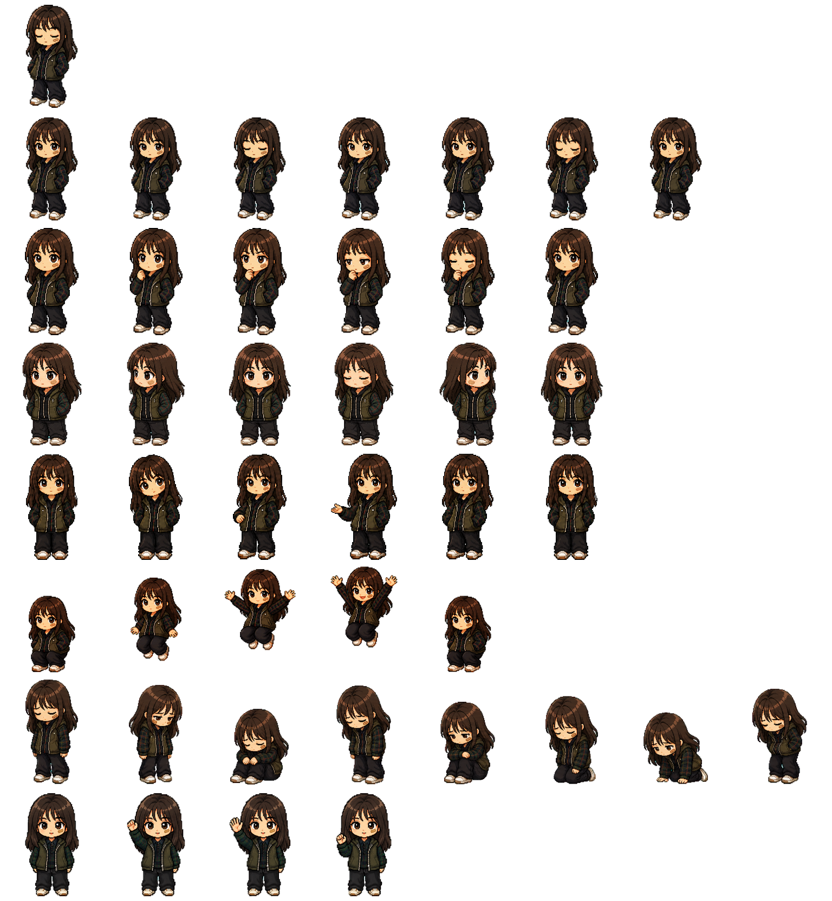
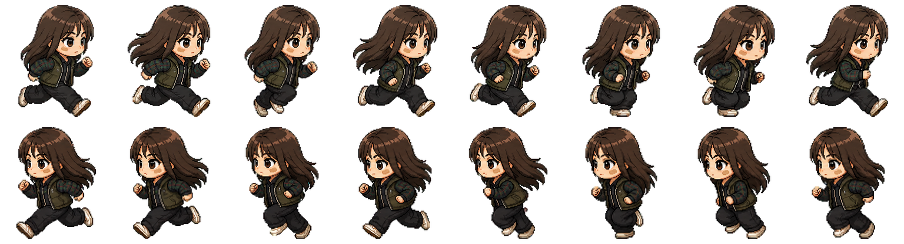
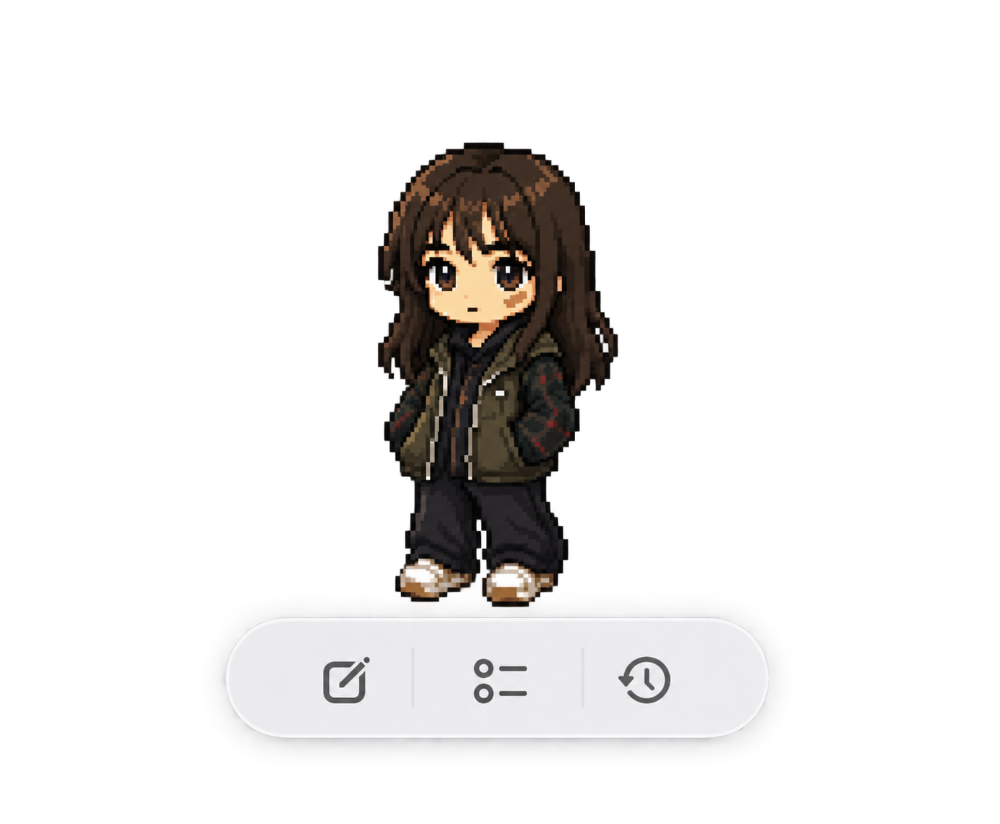

<h1 align="center">DSH Pet</h1>

<p align="center">
  以小雨的像素形象，把 DeepSeek Harness 的 Agent 状态带到 macOS 桌面<br>
  随时查看任务、接收提醒、发送消息
</p>

<p align="center">
  macOS 14+ · SwiftUI 原生应用 · 需要 DeepSeek Harness（DSH）运行
</p>

<p align="center">
  <a href="#-安装">⬇️ 安装 DSH Pet</a>
</p>

## 这是什么？

**DSH Pet** 是 DeepSeek Harness 的 macOS 桌面伴侣。它默认以小雨的形象显示 Agent 状态：
待机、思考、等待授权或回答、完成和失败都有对应动作。你可以把桌宠拖到屏幕任意位置，
通过状态气泡和任务卡片了解进度，也能直接从桌面向 Harness 发送消息；浏览器最小化后仍可使用。

心情球仍可在「设置 → 外观 → 桌宠」中选择。

### 项目组成

- **DSH Pet.app**：以小雨为默认形象的 macOS 桌宠应用，也提供心情球皮肤
- **dsh-moodball-status**：状态与输入桥接插件（订阅 Agent 会话事件，提供 HTTP/状态 Socket 兼容接口，以及用户级命令 Socket；无 Harness Web UI、无设置项）

插件包名和应用数据目录暂沿用 `dsh-moodball` / `MoodBall`，以兼容已有配置。安装脚本会清理旧版 `MoodBall.app`。
截至 2026-09-26，最新 Release 仍是旧版心情球（v0.5.2），尚未提供 `DSH-Pet.app.zip`；要使用当前版本的 DSH Pet，请按下方步骤从本仓库构建。

一切配置都在 app 的设置面板里完成。

### 小雨动作帧

<p align="center">
  
</p>

<p align="center">
  项目使用的原始动作图集：从上到下依次是未连接、待机、思考、等待授权、等待回答、完成、失败和挥手
</p>

<p align="center">
  
</p>

<p align="center">
  左右拖动时的奔跑动作帧
</p>

## 🚀 安装

### 先运行 DeepSeek Harness

DSH Pet 需要 **macOS 14+** 和正在运行的 DeepSeek Harness。按[官方中文 README](https://github.com/deepseek-ai/deepseek-harness/blob/master/README.zh.md)选择一种 Web 启动方式：

安装 Node.js 后，直接通过 npm 运行：

```bash
npx @deepseek-ai/dsh web
```

或安装 pnpm，从官方源码构建并运行：

```bash
git clone https://github.com/deepseek-ai/deepseek-harness.git
cd deepseek-harness
pnpm install
pnpm run build
pnpm dsh web
```

两种方式默认在 `http://127.0.0.1:3080` 打开 Web UI。已有 DeepSeek Harness 桌面版的用户也可以继续使用桌面版；其插件安装步骤见下文。

### 安装 DSH Pet（当前版本）

安装 Xcode 命令行工具后，另开一个终端执行：

```bash
git clone https://github.com/sundusk/dsh-pet.git
cd dsh-pet
MOODBALL_SKIP_OPEN=1 bash make-app.sh
bash install.sh
```

`make-app.sh` 构建带小雨图集的 `dist/DSH Pet.app`。`install.sh` 使用这个本地产物，并会：

1. 检测当前正在运行的 Harness，并识别桌面版、NPM/NPX 版或源码版
2. 源码版在实际源码根目录执行 `pnpm dsh`；NPM/NPX 版执行对应的 `dsh` 或 `npx @deepseek-ai/dsh` CLI
3. CLI 版在目标 Harness 的 `web` profile 中检测/安装状态插件；桌面版通过应用内「插件」页面安装
4. 安装刚构建的 `DSH Pet.app`
5. 优先安装到 `/Applications`，无权限时自动回退到 `~/Applications` 并启动；安装后只保留一个 `DSH Pet.app`，旧版 `MoodBall.app` 和重复构建副本会移入废纸篓

安装脚本只需要执行一次。若插件刚安装而当前 Harness 正在运行，脚本仍会继续安装并启动
`DSH Pet.app`；请在当前任务完成后重启一次 DeepSeek Harness 让插件加载，**无需再次运行安装脚本**。
如果 Harness 当前没有运行，DSH Pet 会先显示“未连接”，启动 Harness 后自动连接。

安装器不会自动停止或重启正在运行的 Harness，也不会把状态接口暂时不可达直接判断为“插件未安装”。
如果同时存在多个源码版 Harness 且当前都未运行，会要求选择目标；不会静默把插件装进错误的仓库。

源码版也可以显式指定：

```bash
DSH_SOURCE_ROOT="$HOME/Projects/deepseek-harness" bash install.sh
```

安装器会复用当前环境或已识别 Harness 的 `DSH_HOME`，并将最近使用的 Harness 类型、源码路径和 profile
记录在 `~/Library/Application Support/MoodBall/config.json`，供下一次安装使用。

桌面版使用独立的 `desktop` profile。请在桌面版「插件」页面安装并启用 `github:sundusk/dsh-pet`，再重启桌面版让插件加载。公开 `dsh plugin` CLI 不能管理桌面版 profile；安装器检测到桌面版时不会把插件误装到 `web` profile。DSH Pet 使用本地 Socket 接收桌面版状态；桌面版晚启动或重启后会自动重连。

### 手动安装桥接插件

如果只安装了应用、需要单独补装插件，请根据 Harness 的启动方式执行对应命令，然后重启 Harness：

```bash
# 通过 npx 运行 Harness
npx @deepseek-ai/dsh plugin --profile web add github:sundusk/dsh-pet

# 已安装全局 dsh 命令
dsh plugin --profile web add github:sundusk/dsh-pet

# 从源码运行 Harness：先进入 deepseek-harness 源码根目录
pnpm dsh plugin --profile web add github:sundusk/dsh-pet
```

桌面版请使用其「插件」页面；上面的 CLI 命令只针对 `web` profile。

## ✨ 使用

安装并启动后，**桌面上没有任何窗口**——它是个纯菜单栏应用（不占 Dock、不抢焦点）：
菜单栏右侧出现状态图标，桌面右下角出现小雨（或你选择的其他皮肤）。

### 以后怎么打开？

- **访达 → 应用程序（或 ~/Applications）**：找到「DSH Pet」，双击
- **终端**：`open -a "DSH Pet"`

### 菜单栏图标功能

| 菜单项 | 功能 |
|---|---|
| 状态文字 | 当前连接状态、状态名与桥接方式（如「已连接 · 工具调用 · 本地桥接」） |
| 隐藏 / 显示宠物 | 隐藏或显示桌宠及其操作栏 |
| 设置… | 打开设置面板 |
| 退出 | 退出 app（不影响 DSH 本体） |

### 小雨交互

- **拖动**：按住小雨拖动，她会朝拖动方向奔跑，并记住停留位置
- **双击**：待机时小雨会挥手
- **锁定位置**（设置面板 → 行为）开启后不可拖拽，仍可双击

### 第一阶段：快捷入口

- 默认按 **Option+Space**，可在「设置 → 快捷键」重新录入组合键或关闭。快捷键冲突时 DSH Pet 不会抢占其他应用，并会在设置面板提示。
- 「设置 → 快捷键」的“功能快捷键”区域可分别修改或关闭输入消息、新建会话、选择工作区、打开 Harness、显示/隐藏宠物、打开设置和状态展示的菜单快捷键；默认使用不冲突的 `⌘` 组合键。
- 快捷键会显示并聚焦输入框；输入框已打开时重复按下不会关闭、不清空草稿。按 Esc 收起输入框，中文输入法选字时 Enter 仍只确认候选文字。
- 菜单栏“隐藏/显示宠物”同时控制桌宠及其操作栏。点击穿透设为“永远点击穿透”时，仍可通过全局快捷键唤起输入框。

### 向 Harness 发送消息

宠物下方的短横条会在鼠标靠近时变成笔记按钮。点击后展开原生输入框：

- 首次发送前选择 Harness 已注册的工作区，DSH Pet 会记住目标。
- Enter 发送，Shift+Enter 换行；中文输入法选字时 Enter 只确认候选文字。
- 第一条消息创建 DSH Pet 专用会话，后续消息沿用同一会话；执行中、等待授权或等待回答时暂时不能继续发送。
- “新建会话”只解除当前绑定，不会删除或停止旧 Harness 任务；“打开 Harness”进入现有 Harness 首页。
- 命令插件不可用时仍可显示旧版状态，但输入功能会明确禁用；草稿不会被静默丢弃。

### 第二阶段：多任务卡片与提醒

- 待机时保留宠物下方的短横线；鼠标靠近后展开底部功能栏，从左到右分别是输入消息、当前任务和最近任务。

<p align="center">
  
</p>

<p align="center">小雨与底部功能栏（透明背景）</p>

- 当前工作区的普通 Harness 会话会显示为任务卡片，子 Agent 不单列。多任务默认只显示排序第一项，箭头展开纵向列表，最多直接显示四张，超出部分在卡片区域内滚动。
- 排序优先级为等待操作、失败未读、完成未读、运行中、其他最近更新任务。点击卡片查看详情并标记已读；“继续此会话”才会切换输入目标，当前草稿不为空时会先阻止切换。
- 任务标题、状态图标和更新时间优先来自 Harness；标题服务不可用时使用工作目录和会话 ID 后缀回退。未读位置由 DSH Pet 本地保存，首次加载不会把历史任务批量标成未读，重连后会继续使用已读位置。
- 精确打开会话仍未发现可由插件调用的官方外部深链，因此详情提供“打开 Harness”和“复制会话 ID”。

### 第三阶段：截图附件

- 在输入框内直接粘贴剪贴板图片，或点击回形针菜单选择“框选截图”；框选期间桌宠和快捷控件会暂时隐藏，完成或取消后恢复。
- 图片先保存在 DSH Pet 的私有草稿目录并显示缩略图，可移除；提交失败会保留文字和图片，并提供重试。只有 Harness 确认接收后才清理应用私有副本。
- 支持图片单独发送，也支持图片随文字发送。数量、单张大小和总大小使用当前 Harness 部署返回的限制，不写死默认值。
- DSH Pet 将图片交给官方 `sessionController.prompt` 附件入口，由 Harness 校验当前模型的图像能力并持久化；不会把本机临时文件路径作为消息内容，也不会删除 Harness 已保存的附件。

### 桌宠皮肤

设置面板 →「外观」→「桌宠」可即时切换：

首次安装默认显示小雨；之后会记住你选择的宠物。

- **小雨**：使用迁移自 Harness Desktop 的像素图集，支持待机、思考、授权、提问、完成、失败、挥手，以及左右拖拽奔跑。
- **心情球**：保留原有呼吸、眨眼、气泡和状态颜色。

两种皮肤共用 Agent 状态、显隐、大小、气泡、发光、穿透和位置记忆设置。
小雨的悬浮窗口按精灵和光晕收紧；状态气泡出现时才向上扩展，精灵之外的透明区域不会触发展开操作栏。

### 状态展示

菜单栏 →「状态展示…」（⌘D）：查看每个状态下心情球的实时外观，可切换气泡文字的显示与隐藏，
并可将当前状态保存为 PNG 图片。

### 心情球的颜色含义

| 状态 | 心情球 | 颜色 |
|---|---|---|
| 空闲 |  | 蓝色 |
| 正在思考中 |  | 绿色 |
| 工具调用 |  | 紫色 |
| 等待你的授权 |  | 黄色 |
| 做出你的抉择 |  | 粉色 |
| 搞定啦 |  | 青色 |
| 出错了 |  | 红色 |
| 停止 / 中断 |  | 黑色 |
| 未连接 / 插件未装 |  | 灰色 |

**心情球的颜色可以在设置面板自定义。**

### 状态桥接与设置面板

插件会优先向 `~/Library/Application Support/MoodBall/moodball.sock` 推送换行分隔的状态 JSON；本地桥接不可用时，app 自动回退到设置中的 HTTP 地址 `/api/moodball/status`，并继续尝试本地 Socket。桌面版的 Host 默认端口与 CLI Web 版不同，使用桌面版时以本地 Socket 为准。
DSH Pet 的状态 Socket 只读；输入功能由独立的用户级命令 Socket 转发到官方 `workspaceRegistry` / `sessionController`。DSH Pet 不会启动、停止、升级或修改 Harness，也不模拟 Web UI。

菜单栏 →「设置…」可调整：球大小、呼吸速度、8 种状态颜色、眼睛开关与颜色、
**气泡文字开关**、**发光开关**、**锁定位置**、API 地址、轮询间隔、点击穿透模式等，修改立即生效。

「行为」Tab 底部还有**版本与更新**：显示当前版本，自动/手动检查 GitHub Releases
是否有新版本，有则给出「前往下载」链接。

### 卸载

```bash
git clone --depth 1 https://github.com/sundusk/dsh-pet.git
cd dsh-pet
bash uninstall.sh
```

脚本会退出并移除 `DSH Pet.app` 与旧版 `MoodBall.app`（检查 `~/Applications` 和 `/Applications`），
并询问是否同时移除 `dsh-moodball-status` 插件（移除后重启 dsh web 生效）。

### 常见问题

- **小雨显示未连接，或心情球是灰色的？** 先确认目标 Harness 正在运行、状态插件已安装并启用。CLI 版检查 Web 服务与 `web` profile；桌面版检查应用内「插件」页面与 `desktop` profile，插件刚安装后需重启桌面版。
- **「设置 → 插件」里怎么没有 DSH Pet 插件卡片？** 这是正常的——桥接插件没有任何设置项
  （所有配置都在 app 的设置面板里），所以不显示配置卡片。可在「设置 → 插件 → **插件列表**」
  中查看它（状态为「已挂载」）。

## 🔧 开发

```bash
# 插件（dsh-moodball-status）：构建到 lib/
pnpm install
pnpm build

# app：构建 dist/DSH Pet.app（含小雨图集）并启动
bash make-app.sh
```

## 📄 License

本项目采用 [MIT License](LICENSE) 发布。
